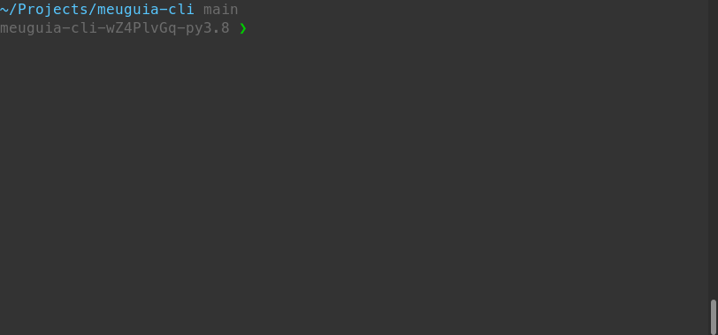

# MeuGuia TV CLI

MeuGuia TV é uma interface de linha de comando que permite realizar buscas em tempo real de conteúdo multimídia disponível no site [meuguia.tv](https://meuguia.tv/)

## Como usar

Clonar o repositório

```sh
git clone https://github.com/vcwild/meuguia-cli.git
```

Instalar as dependências de execução

```sh
pip install -r requirements.txt
```

Dentro do repositório, executar

```sh
python guia.py [comando] --flags
```

## Comandos

Os comandos da CLI devem ser executados na raiz do projeto

### Listar todos os comandos disponíveis

```sh
python guia.py --help
```

### Listar as categorias de conteúdo

Retorna a lista de todas as categorias de conteúdo disponíveis para procura

```sh
python guia.py categorias
```

### Listar os canais de uma categoria de conteúdo

Retorna a lista de canais disponíveis referentes ao conteúdo procurado

```sh
python guia.py categoria [categoria]
```

### Listar o conteúdo ao vivo de um canal

Retorna um array com o conteúdo ao vivo referente ao canal

```sh
python guia.py canal [nome]
```

## Licença

O projeto está sob a licença [Apache 2.0](/LICENSE).
